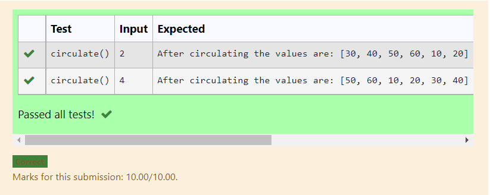

# Circulate-the-values-of-N-variables
## Aim:
To write a python program to circulate the n variables using function concept
## Equipment’s required:
PC
Anaconda - Python 3.7
## Algorithm: 
### Step 1:def circulate()

### Step 2:n=int(input()) 
### Step 3: Get the value from the user for the number of rotation
### Step 4: Using the slicing concept rotate the list
### Step 5: l=l[n:]+l[:n]
### Step 6:  print
## Program:
def circulate():
    n=int(input())
    l=[10,20,30,40,50,60]
    l=l[n:]+l[:n]
    print("After circulating the values are:",l)

## Output:

## Result:
The code is running successfully.
